# MarkDown Mermaid sequence diagrams

This repository collects snipperts of sequence diagrams modelled in Mermaid
embedded in MarkDown.

This is natively support in GitHub MarkDown preview and an extension for VS Code
exists to add Mermaid support to the VS Code MarkDown preview:
https://marketplace.visualstudio.com/items?itemName=bierner.markdown-mermaid

Here's some information about sequence diagrams in Mermaid straight from the
horse's mouth:
https://mermaid.js.org/syntax/sequenceDiagram.html

## General notes

### `sequenceDiagram` configures the type of diagram and cannot be left out

```mermaid
sequenceDiagram
```

This sequence diagram has only the `sequenceDiagram` and is valid, an empty
MarkDown `mermaid` code block would not be valid.

### The indentation can be 2 characters not just 4 characters or a tab

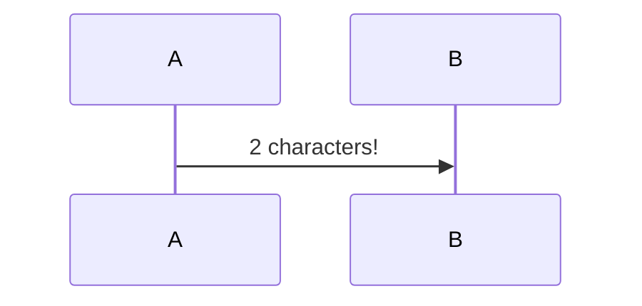


### `participant` is no required, participants can be introduced implicitly


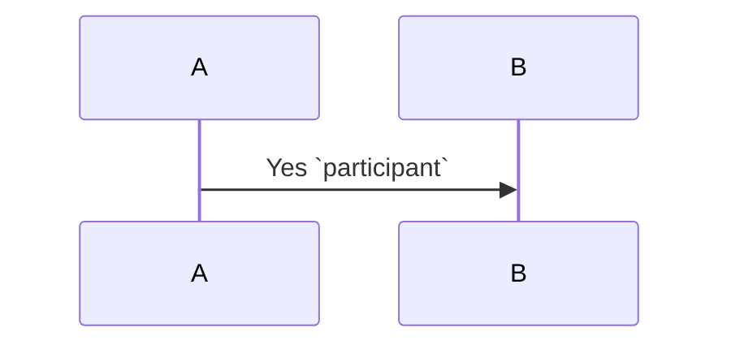

### `participant` can still be used to introduce participants or alias them

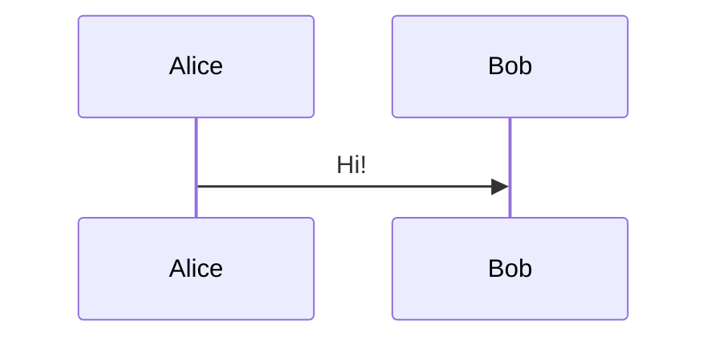

### `participant` can be replaced with `actor` to render a rudimentary character

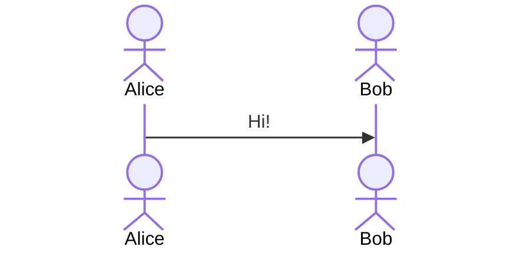

### Participants introduced implicitly later will appear as have existed forever

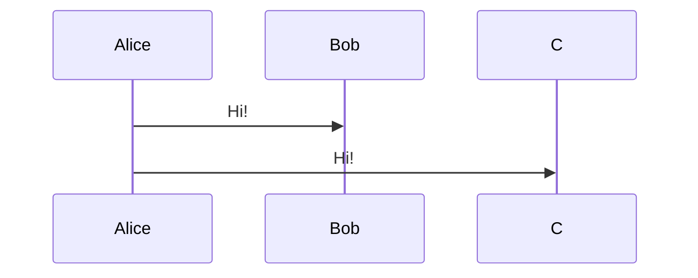

`C` appears on the last line of the diagram code, but in the diagram itself,
their thread starts at the top as with the other participants.

### Participants can be created and destroyed with messages to counteract this

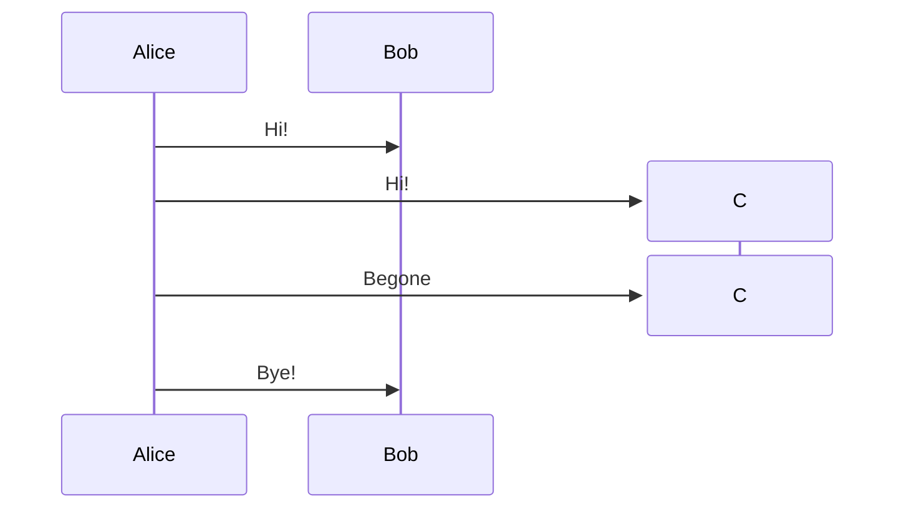

This uses `create participant C` combined with `destroy C` where each of these
lines must be followed by a message to the participant the action relates to.

### There are various solid and dashed connection lines with arrows or crosses

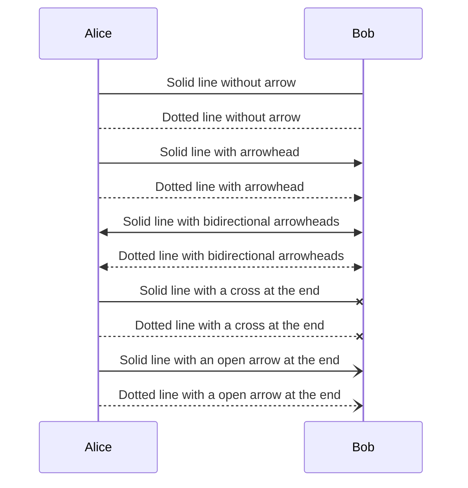

There is some intended extra meaning behind these styles (sync versus async
communication) which I don't see myself respecting.

Additionally, the open arrow lines look pretty bad in the VS Code extension and
are highlighted in red in the VS Code MarkDown document code block because they
appear as unclosed parentheses.
Also don't see myself using these at all.

### Participants can be grouped in boxes with titles and background colors

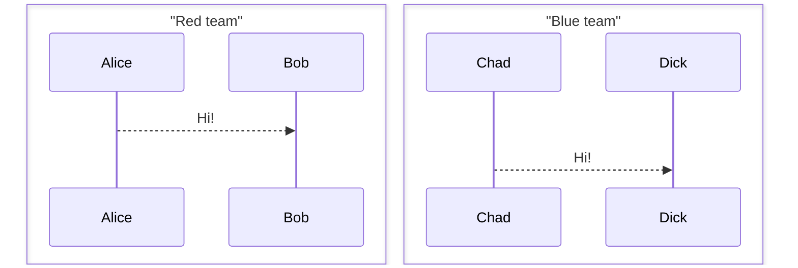

Boxes can be colored with `box color` and titled with `box color title` or just
titled if the first name of the title doesn't dot match a color name.
Enclose the title in quotes to make sure its first word does not get interpreted
as a color should that happen and be undesirable.

### Participants can be activated and deactivated (similar to created/destroyed)

There is `activate` and `deactivate` for this:

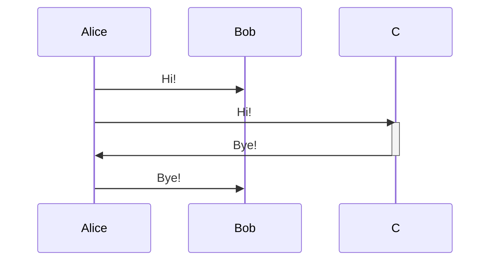

It can also be done with the message with which the activation/deactivation
should happen by appending `+` to activate and `-` to deactivate after the
message line.

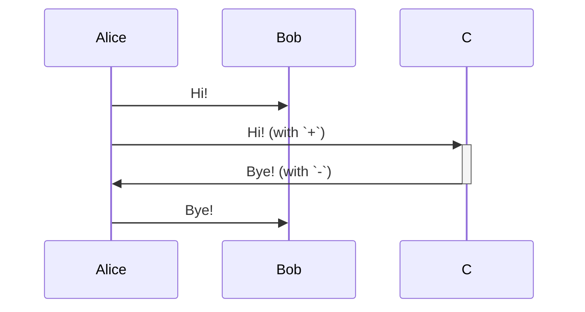

This leaves the participants' threads running forever, but it creates this sort
of a block to designated when they are active/inactive.

It can be combined with creating and destroying participants:

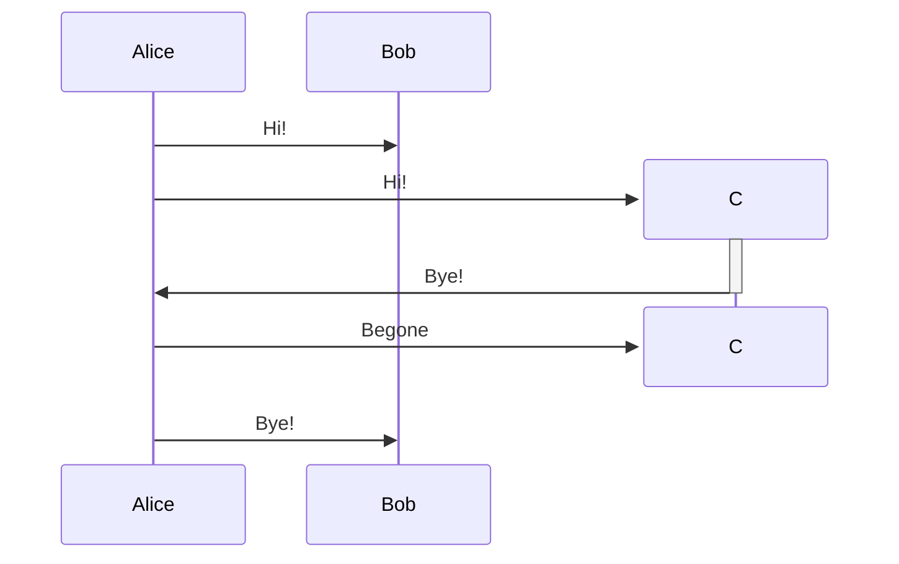

It doesn't seem to work with the `+` and `-` shortcuts in this scenario.

Activations can be nested:

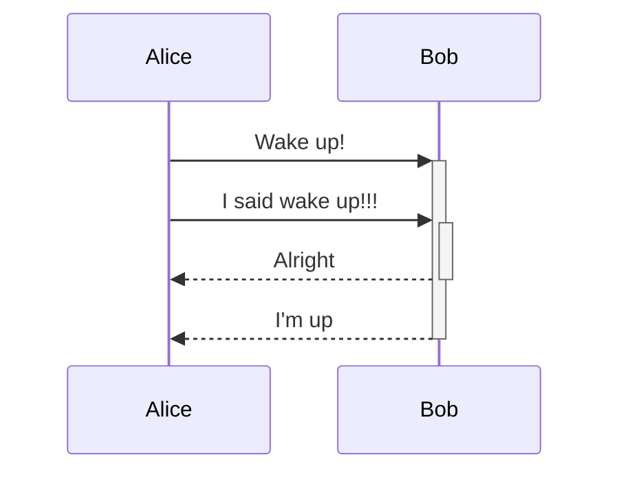

### Notes can be attached to the left of, over or to the right of participants

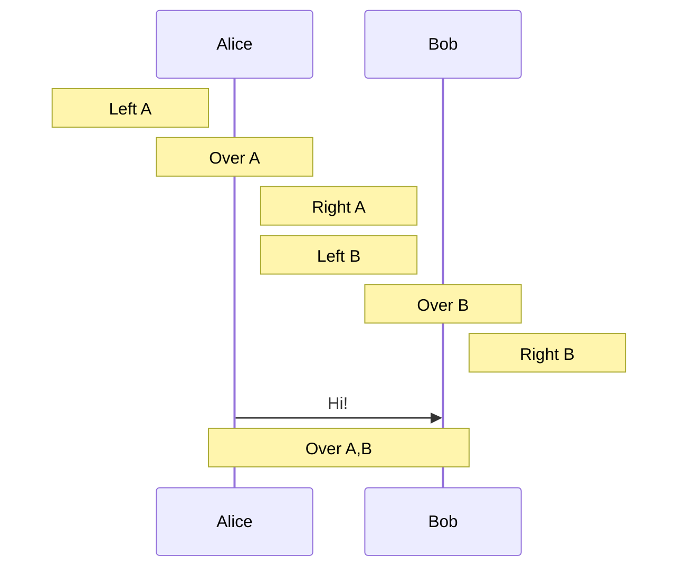

Line breaks in notes are added via `<br />`. :/

### Comments in Mermaid code are added with the `%%` prefix

### Stuff I know of but probably won't be using so won't be expanding on

- `loop` for loops
- `alt`, `else`, `opt` for alternative paths, optional paths
- `par` for parallel paths
- `critical`, `option` for required events
- `break` to model exceptional paths
- Colors, be it on participant `box`es or general `rect`s
- Escape codes
- Actor links
